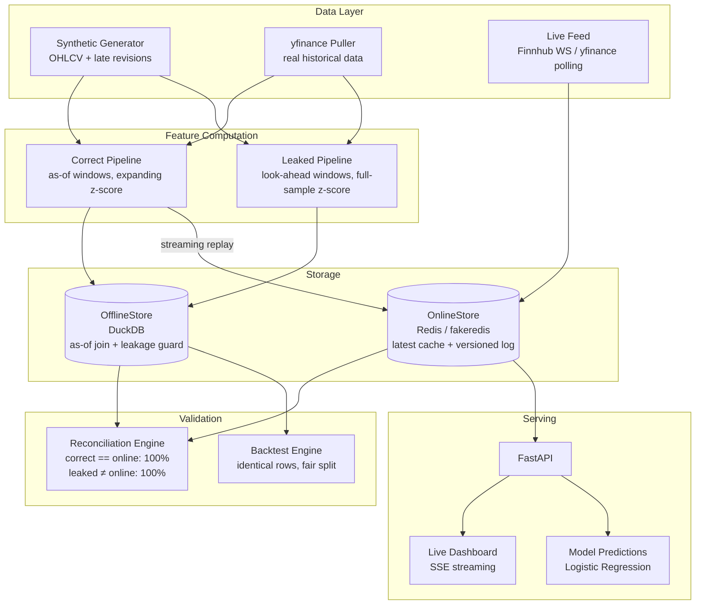

# marketstore

## The Problem

Imagine you build a model that predicts whether a stock will go up tomorrow. You train it on historical data, backtest it, and the numbers look incredible: 62% accuracy, a Sharpe ratio above 4. You're confident, so you deploy it. But nothing works-

The model isn't broken. The data is. During training, your pipeline quietly peeked at information it shouldn't have had, which was tomorrow's price revisions baked into today's features, statistics computed over the entire dataset instead of only the past. The model learned patterns that were real in hindsight but impossible to know at the time. In production, where you only have what you know *right now*, those patterns don't exist.

This is called **online/offline skew** : when the data your model trains on and the data it sees in production silently disagree. It's one of the most common and expensive failures in applied machine learning, and it's hard to catch because everything *looks* fine until you're live and losing money.

**marketstore** is a feature store built to make this impossible. It enforces a simple rule: a feature value can only be used if it was actually knowable at the time of the decision. It proves this guarantee mathematically, demonstrates exactly what breaks without it, and now includes a real-time live market data feed so you can watch the system work against actual prices.

---

## About the Project (Technical)

### Architecture



### Core Mechanism: Bitemporal Two-Timestamp Model

Every feature value carries two timestamps (`src/marketstore/schema.py`):

- **`event_timestamp`** — when the fact became true in the world (the trading day)
- **`knowledge_timestamp`** — when the system could actually *know* it (>= event, delayed by revisions/late arrivals)

A read is point-in-time-correct iff for request time `T`, it returns only values with `knowledge_timestamp <= T`. This single predicate is the correctness primitive enforced by the offline store's as-of join with a hard guard that raises on violation.

### Tools & Stack

| Layer | Technology |
|-------|-----------|
| Offline Store | **DuckDB** — SQL-native as-of joins, no server required |
| Online Store | **Redis** (via **fakeredis**) — O(1) latest-value cache + ZSET versioned log |
| Feature Computation | **pandas** + **NumPy** — rolling/expanding windows, z-scores |
| Model | **scikit-learn** — Logistic Regression (intentionally simple; the model is not the subject) |
| Serving | **FastAPI** + **Uvicorn** — REST API, SSE streaming |
| Live Data | **yfinance** (polling) / **Finnhub** (WebSocket) — real-time market feed |
| Testing | **pytest** — 11 tests covering as-of correctness, bitemporal revisions, online/offline consistency |

### Metrics: What It Catches

Same model. Same time-ordered split. Same 3,304 evaluation rows. The **only** difference is which feature pipeline produced the values:

| Path | Accuracy | ROC-AUC | Sharpe Ratio |
|------|:--------:|:-------:|:------------:|
| **Correct** (point-in-time) | 0.535 | 0.544 | 1.21 |
| **Leaked** (online/offline skew) | 0.622 | 0.660 | 4.64 |

The leaked pipeline fabricates **+8.7 points of accuracy** and inflates the Sharpe from 1.21 to 4.64. None of it is recoverable in production.

The Sharpe ratio is computed with realistic frictions: continuous position sizing (scaled by model conviction), 5 bps transaction costs on turnover, 2 bps slippage, and 10% max position per name.

### Consistency Proof

Across 1,600 random `(entity, time)` point-in-time checks:

- **Correct offline == Online store: 100.0%** — the two pipelines agree perfectly
- **Leaked offline == Online store: 0.0%** — every single point diverges
- Mean absolute skew of leaked features: **0.091** (in standardized units)
- Max absolute skew: **1.004**

### The Two Leaks Reproduced

1. **Normalization leak** — `volume_zscore` uses full-sample mean/std (peeks at entire series including future) instead of an expanding past-only window
2. **Look-ahead window leak** — rolling features computed with centered/forward-shifted windows that include bars postdating the decision point. A streaming pipeline physically cannot make this mistake; a careless batch job does it constantly.

### Live Market Data

The system streams real-time prices via two providers:

- **Finnhub WebSocket** — true tick-level real-time (free API key at finnhub.io)
- **yfinance polling** — near-real-time at ~15s intervals, no API key required

Live ticks are aggregated into OHLCV bars, features are recomputed incrementally from a rolling window, and updated vectors are written into the online store — the same causal, point-in-time-correct path the batch pipeline uses. Users can dynamically subscribe to any ticker through the dashboard or API.

## Run It

```bash
make setup                # install dependencies
make data                 # generate synthetic raw data
make test                 # 11 tests: as-of correctness, bitemporal, consistency
make demo                 # end-to-end: consistency proof + backtest
make report               # writes results/metrics.json + comparison.png
make api                  # start FastAPI server, open http://localhost:8000

# Live market data
make live-yfinance        # start with yfinance polling (no API key)
make live-finnhub         # start with Finnhub WebSocket (set FINNHUB_API_KEY)

# Real historical data
make real-data            # one-shot pull from Yahoo Finance
make real-data-vintage    # accumulate real revision history (run on cron)
```

## Limitations

- The headline metrics are from synthetic data with a deliberately weak, known-ceiling signal — performance above it is provably leakage, not luck
- The model is intentionally trivial (logistic regression) because the infrastructure guarantee is the subject, not the alpha
- Universe is 8 tickers; the system is a demonstration, not a production deployment
- Live feed on weekends/market-closed hours returns the last available data
